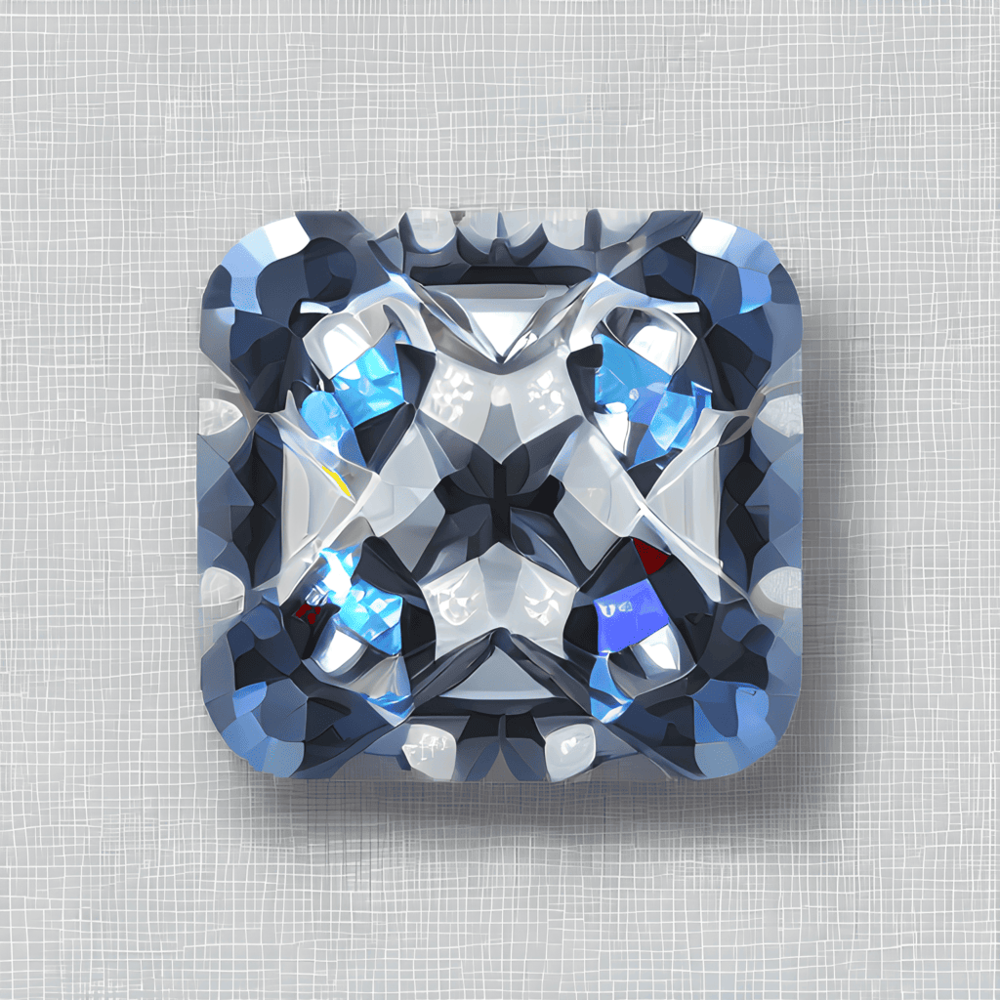

# rhinestone

Creating permissionless wallet innovation

## Overview

At Rhinestone, we’re building a platform that facilitates module development, from development frameworks and third-party tooling, all the way through to automated audits and installation on the user’s account. We provide distribution through a module marketplace and turnkey business models for monetization.

Our developer stack:

- ModuleKit: A development framework to streamline the process of building, testing and deploying modules for different smart account implementations
- WalletKit: An integration kit that allows wallets to use third-party modular components in their UI
- Module Registry: A permissionless registry that allows developers to register their modules and auditors to attest to their security

Learn more by taking a look at our [docs](https://docs.rhinestone.wtf).

## Building Modules

- Module building and testing framework: [ModuleKit](https://github.com/rhinestonewtf/modulekit)
- ModuleKit template: [Template](https://github.com/rhinestonewtf/module-template)
- Module examples: [Examples](https://github.com/rhinestonewtf/modulekit-examples)

## Registry

- Module Registry: [Reference impementation](https://github.com/rhinestonewtf/registry)
- Advanced Registry use-cases: [Registry integrations](https://github.com/rhinestonewtf/registry-integrations)

## ERCs

- Adapter standard: [ERC-7484](https://eips.ethereum.org/EIPS/eip-7484)
- Modular Account standard: [ERC-7579](https://github.com/erc7579/)

## Resources

- Module ideas: [Non-exhaustive list](https://rhinestone.notion.site/Module-ideas-for-product-inspo-338100a2c99540f490472b8aa839da11)
- Wallet reference implementation: [Demo video](https://rhinestone.wtf/demo)
- Our Blog: [Medium blog](https://blog.rhinestone.wtf)

## Security

If you believe you have found a security vulnerability, we kindly ask you to responsibly disclose this to us and not open a public issue.

Please email <security@rhinestone.wtf> or dm our twitter to disclose any security vulnerabilities.
